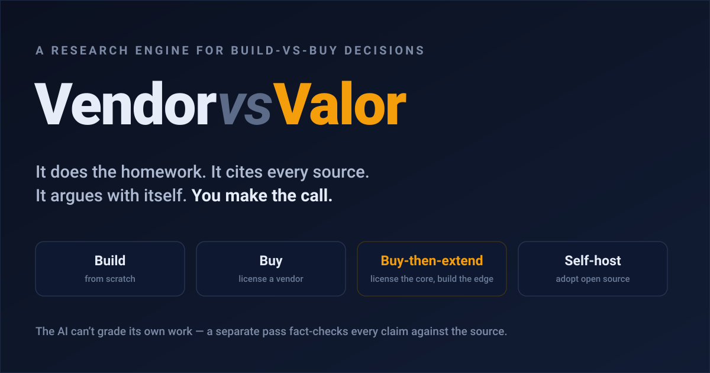

# Vendor vs Valor

### A research engine for the most expensive question in software: build it, or buy it?

**By Rohan** · June 21, 2026
*The engine fact-checks every claim it makes. The least this post could do was return the favor.*

---

If you've ever run engineering for more than one product, you know the question. It comes back every quarter, wearing a different costume: a vector database this time, a billing system the next, a fraud model after that. *Do we build this ourselves, or pay someone else for it?* This is a tool that does the homework behind that question, cites every source, argues with itself, and then hands the decision back to you. It does not decide. That part is still yours, and it should be.

---

## The question that looks technical but isn't

"Build or buy" sounds like an engineering call. It isn't. It's a capital decision wearing an engineering costume.

Get it wrong and you don't just lose a sprint. You inherit a vendor you can't leave, a "cheap" subscription with switching costs nobody priced, or a homegrown system that quietly eats two engineers a year for the rest of its life. The bill doesn't arrive on launch day. It arrives in year three, with interest.

Now run a portfolio of companies, and it gets worse. The same question gets answered independently, six times, by six teams who never compared notes. Six vendor evaluations for the same database. Six gut calls. A thing that would've been cheap to build *once* and share gets bought *six times* instead. Nobody's keeping the receipts.

## Why the usual answers don't hold up

The default playbook for this decision is thin, and everyone knows it:

- **A consultant.** Expensive per call, gone when they leave, and the knowledge walks out with them.
- **A checklist.** A human still does one hundred percent of the research, at whatever depth they had time for that week.
- **A gut feeling off a vendor demo.** Demos are sales. Of course it looked good.
- **A spreadsheet with weighted scores.** This one's the sneakiest, because it *looks* rigorous. You pick fourteen factors, assign weights, multiply, and out pops a number: 4.1. But you invented every weight, and the number inherited all of your guessing while losing the part where you could see it. It's false precision. Confidence cosplay.
- **A generic AI research bot.** It'll research anything, which is exactly the problem. It doesn't know what a build-vs-buy decision is *shaped* like.

None of them compound. None of them cite their sources. None of them know the decision's anatomy. So we built one that does.

## What it actually does

Give it a capability you need, described in plain English. It runs a pipeline, and parks for your approval three times along the way.

**It interviews you.** Not a form. A conversation that pulls out the things that actually move the decision: how core this is to your product, what you can spend, your timeline, your compliance constraints, and what you care about most, in your own words. It knows nothing about your industry in advance, and that's deliberate. It asks instead of assuming.

**It researches both sides, in parallel.** One track digs into *building* it: the real engineering effort, the open-source pieces you'd stand on, the maintenance bill that compounds. The other digs into *buying* it: who sells it, what it costs now and at renewal, how locked-in you'd get, whether you could even extend it. Two piles of evidence. Same photo, two different lights.

**It checks its own work, and it doesn't get to grade itself.** More on this below, because it's the best idea in the project.

**It reasons over four ways out, not two.** Build. Buy. Buy-then-extend (license the boring core, build the part that makes you special on top). Or adopt-and-self-host (take the open-source thing and run it yourself). Most real decisions land on one of the middle two, which is exactly why a tool that only offers "build" and "buy" feels naive.

**It argues against its own answer.** Before it commits, a second pass plays devil's advocate and builds the strongest case it can for a *different* path. If it can't beat the original, that's earned confidence. If it can, you get a real second opinion instead of a rubber stamp.

Out the other end: a recommendation, a runner-up, the exact conditions under which the runner-up would win, the two or three factors that actually drove the call, and an honest list of what it couldn't figure out. Plus a standalone report you can open in a browser, with every claim clickable back to its source.

## The one idea worth stealing

Here's the part that makes the whole thing trustworthy.

**The reporter doesn't get to grade their own story.** The AI doing the research can file a claim and a supporting quote, but it is never allowed to mark its own claim as verified. A separate pass re-reads the actual source and decides, independently, whether it holds up. And you can't cite a document that isn't already on the table: the engine can only quote from pages it actually fetched and saved, frozen at the moment it read them.

That sounds like a small plumbing detail. It's the whole ballgame. Most AI tools ask the model to *please be careful* and hope for the best. This one enforces carefulness with code instead of asking nicely. The thing that *writes* a claim is never the thing that *clears* it. That's the same reason your accountant doesn't get to audit their own books.

That's not a hypothetical problem. [A 2026 study of deep-research agents](https://arxiv.org/html/2605.06635v1) found today's frontier models keep citation link validity above 94% and topical relevance above 80%. So the citations look fine. But the citation's actual factual accuracy lands at only 39–77%, and it gets worse the longer the agent keeps digging: one model's accuracy fell from 78.6% at the start of a research session to 16.7% after 150 tool calls. Most of these tools still let the model that wrote a claim grade it too. This one doesn't, and every run keeps the full paper trail: every page it fetched, saved exactly as read, so you can check the receipts again in six months instead of trusting them once.

Two more decisions in the same spirit:

- **It refuses to score.** No weighted 1-to-5 theater. It names the handful of factors that actually decided things and shows its reasoning, so you can argue with the logic instead of squinting at a number.
- **It knows the edge of its own competence.** An earlier version could recommend *acquiring* a company. We cut it. Valuing an acquisition needs financial and legal diligence that no amount of web research can responsibly produce. A tool that knows what it *can't* know is worth more than one that fakes it.

## What it looks like on a real problem

A small, bootstrapped fintech needs reliable historical and live data for Indian capital markets. Money's tight. Data quality is non-negotiable. They're running anomaly detection on it. There's a hard four-week deadline. And Indian market data sits behind real regulatory walls: the exchanges and the regulator strictly control who can redistribute it.

The engine's recommendation: **buy-then-extend.** License a compliant commercial market-data API for the raw feed, because four weeks is not enough time to build licensed exchange integrations from scratch, and scraping the data would be illegal. Then build a thin local layer on top, storing the data in an open format you own, so you control your costs and aren't married to the vendor.

Then the challenger steps in and makes the case for plain **buy**: if the commercial tiers are already cheap enough, the founder's time is worth more than the savings from building a custom caching layer. Just pipe the feed into the database you already run and move on.

Neither answer is "correct." That's the point. The engine surfaced the real tension: data quality and the law pull toward a paid source, while a bootstrapped budget pulls toward keeping costs and lock-in down, and put both cases on the table, each backed by sources you can click through and check. A human walks in already knowing what the argument is actually about.

## What it won't do

It won't approve a purchase. It won't replace your lawyers, your security review, or your procurement team. It won't pretend a missing price is anything other than missing: a vendor who hides their pricing is a finding, not a hole to fill with a guess. And it won't make the call.

That last one isn't a limitation. It's the posture. Research is the part you can safely automate. Judgment about where your money goes is the part you shouldn't. The machine does the reading; a person makes the decision.

## Where it goes from here

Right now it's sharp for a single decision, made well. The natural next step is memory. Every decision a company makes gets stored, so the next service it evaluates starts with that homework already done instead of from zero. Extend that across a company's other products and services, and the same memory keeps paying off. Extend it again, to every company in a portfolio, and a VC or PE firm gets the compounding version: one portfolio company's decision becomes every portfolio company's head start.

The code, the architecture, and the technical decisions behind all of this live in the repo. If you want to see how the reporter-and-fact-checker actually works under the hood, that's where to look.

**→ [github.com/rsitaniya/vendor-vs-valor](https://github.com/rsitaniya/vendor-vs-valor)**
